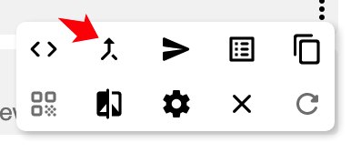
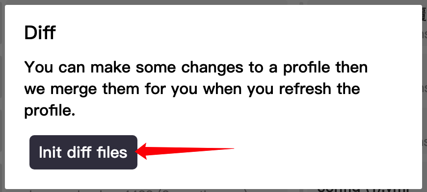
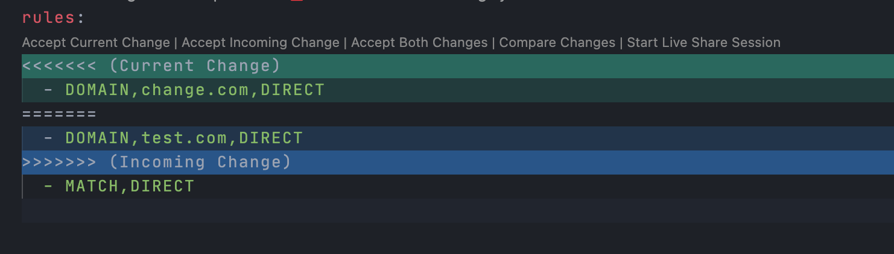

# Diff 处理

Diff 处理即对配置文件进行三路合并，允许在不使用[配置文件预处理](./parser.md)的情况下，保留对配置文件的修改并应用到下次更新。

0.18.4 版本更新后，支持使用 Diff 方式处理配置文件。

如果你熟悉 Git，此方式类似于`git merge`。

## 使用方法

1. 进入 Profiles 界面，在需要设置 Diff 处理的配置文件右侧三点图标悬停，出现菜单后，点击构建 Diff 文件图标：

   
   

2. 此时会调用系统默认编辑器编辑配置文件，对此文件的编辑将会在配置文件更新时自动合并到新的配置文件中
3. 更新一次配置文件

## 冲突

如果远端配置文件发生更新，并且与本地修改产生冲突，将需要手动进行合并。

冲突的格式非常简单：

```
<<<<<<<
  本地修改
=======
  远端修改
>>>>>>>
```

根据自己的需求，把多余的地方删除即可，包括`<<<<<<<`、`=======`和`>>>>>>>`。

如果使用 VSCode，操作更简便：


::: tip
Diff 处理会在预处理之后进行
:::
